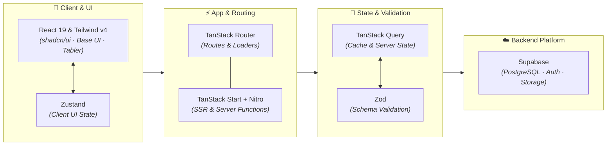

# Tanstack Start base
Frontend web application base, built with **TanStack Start + React 19 + shadcn/ui + Tailwind CSS v4 + Supabase**. Server state via **TanStack Query**, forms via **TanStack Form**, tables via **TanStack Table**, client UI state via **Zustand**.

## Prerequisites

| Tool | Minimum Version |
|---|---|
| Node.js | 22.x |
| pnpm | 9.x |

## Setup from Scratch

### 1. Install Node.js (if not already installed)

Check if Node.js is installed:

```bash
node --version
```

If not, install via one of the following:

**Windows (nvm-windows — recommended):**

```powershell
# Download and install nvm-windows from:
# https://github.com/coreybutler/nvm-windows/releases
nvm install 22
nvm use 22
```

**Windows (direct install):**

Download the LTS installer from https://nodejs.org.

**macOS / Linux (nvm):**

```bash
curl -o- https://raw.githubusercontent.com/nvm-sh/nvm/v0.40.3/install.sh | bash
# Close and reopen your terminal, then run:
nvm install 22
nvm use 22
```

### 2. Install pnpm

```bash
npm install -g pnpm
```

Verify:

```bash
pnpm --version
```

### 3. Clone & Install Dependencies

```bash
git clone <your-repo-url>
cd <your-project>
pnpm install
```


### 4. Configure Environment Variables

```bash
cp .env.example .env
```

Fill in the values in `.env`:

```env
VITE_SUPABASE_URL=https://<your-project>.supabase.co
VITE_SUPABASE_KEY=sb_publishable_...
```

### 5. Start the Dev Server

```bash
pnpm dev
```

Open http://localhost:3000.

## Supabase

The app connects to Supabase through `@supabase/supabase-js`. The client is created once in `src/utils/supabase.ts` and reads `VITE_SUPABASE_URL` / `VITE_SUPABASE_KEY` from the environment.

Data-fetching conventions (query functions resolve valid data or throw, `PGRST116` → `notFound()`, shared client only) are documented in `docs/handbook/04_tanstack_start_query_router.md`.

## Common Commands

| Command | Purpose |
|---|---|
| `pnpm dev` | Start dev server (port 3000) |
| `pnpm build` | Production build |
| `pnpm preview` | Preview production build |
| `pnpm typecheck` | Run TypeScript checks |
| `pnpm test` | Run tests (Vitest) |
| `pnpm format` | Format code (Prettier) |
| `pnpm check` | Check formatting (Prettier) |
| `pnpm lint` | Lint code (ESLint) |
| `pnpm exec biome check --write` | Lint + format (Biome, canonical) |

## Quality Gate

Run these after larger changes or before merging (see `docs/handbook/06_quality_rules.md`):

```bash
pnpm exec biome check --write
pnpm typecheck
pnpm build
pnpm check:encoding
```

## Tech Stack & Architecture

### Component Placement Rule

Where UI and data live is decided by **scope of reuse + domain coupling**, not by "is it UI or logic". The same rule applies to components **and** to data (schemas, `server.ts`, `functions.ts`, `queries.ts`):

| Kind | Home |
|---|---|
| Cross-cutting capability (auth, search, analytics) or used from ≥2 places | `features/[feature]/components/` + `features/[feature]/*.ts` |
| Page-local views (rendered by exactly one route) | `routes/<area>/-components/` |
| Static page content (marketing copy, logo lists, CTA cards) | Inline const data in the route file |
| Domain-agnostic, app-wide UI (layout, shell, section chrome) | `components/common/` |
| Primitives | `components/ui/` |

The `-` prefix inside `routes/` is TanStack Router's official colocation convention — those files/folders are excluded from the route tree. See `docs/handbook/02_architecture.md` for the full rule (promote-don't-predict, static content ≠ data, feature shape).

### Feature shape

```text
src/features/[feature]/
|-- components/        # cross-cutting UI owned by this domain
|-- schemas.ts         # Zod schemas + inferred types
|-- server.ts          # server-only data access (never exported from barrel)
|-- functions.ts       # createServerFn wrappers + validation
|-- queries.ts         # query options + query keys
`-- index.ts           # client-safe barrel (functions/queries/schemas/components, NOT server.ts)
```



| Layer | Technology |
|---|---|
| App framework | TanStack Start (Nitro) |
| Routing | TanStack Router |
| Server state | TanStack Query |
| Forms | TanStack Form |
| Tables | TanStack Table (v9) |
| Client UI state | Zustand |
| Data platform | Supabase (PostgreSQL, Auth, Storage) |
| Validation | Zod |
| UI & Primitives | React 19, shadcn/ui, Base UI, Sonner |
| Styling | Tailwind CSS v4 |
| Icons | @tabler/icons-react |
| Language & Build | TypeScript 7 (native `tsc`), Vite |
| Testing | Vitest |
| Format/Lint | Biome (+ ESLint / Prettier) |

## Documentation

All architecture docs, conventions, and checklists live in `docs/handbook/`.

| Document | Contents |
|---|---|
| [`docs/handbook/00_index.md`](docs/handbook/00_index.md) | Handbook index & reading order |
| [`docs/handbook/01_project_overview.md`](docs/handbook/01_project_overview.md) | Project scope & tech stack |
| [`docs/handbook/02_architecture.md`](docs/handbook/02_architecture.md) | Feature-based architecture & route orchestration |
| [`docs/handbook/03_feature_development.md`](docs/handbook/03_feature_development.md) | Building & refactoring feature modules |
| [`docs/handbook/04_tanstack_start_query_router.md`](docs/handbook/04_tanstack_start_query_router.md) | TanStack Start, Router, Query, Supabase, SSR |
| [`docs/handbook/05_ui_state_patterns.md`](docs/handbook/05_ui_state_patterns.md) | Loading, error, empty, & form action states |
| [`docs/handbook/06_quality_rules.md`](docs/handbook/06_quality_rules.md) | Consistency rules & review expectations |
| [`docs/handbook/07_development_checklist.md`](docs/handbook/07_development_checklist.md) | Dev & review checklist |
| [`docs/handbook/08_zustand_best_practices.md`](docs/handbook/08_zustand_best_practices.md) | Zustand client state & SSR rules |
| [`docs/handbook/09_i18n.md`](docs/handbook/09_i18n.md) | i18n / locale routing |
| [`docs/handbook/10_design_tokens.md`](docs/handbook/10_design_tokens.md) | Design tokens & styling rules |
| [`docs/handbook/11_tanstack_form.md`](docs/handbook/11_tanstack_form.md) | TanStack Form patterns |
| [`docs/handbook/12_tanstack_table.md`](docs/handbook/12_tanstack_table.md) | TanStack Table (v9) patterns |

Project-specific content (per-project, not part of the base) lives in [`docs/project/`](docs/project/).

Agent and automation tools should read [`AGENTS.md`](AGENTS.md) first.

## External Docs

- [TanStack Start](https://tanstack.com/start/latest/docs/framework/react/overview)
- [TanStack Router](https://tanstack.com/router/latest/docs/framework/react/overview)
- [TanStack Query](https://tanstack.com/query/latest/docs/framework/react/overview)
- [TanStack Form](https://tanstack.com/form/latest/docs/framework/react/overview)
- [TanStack Table](https://tanstack.com/table/latest/docs/framework/react/overview)
- [Supabase JS](https://supabase.com/docs/reference/javascript/)
- [shadcn/ui](https://ui.shadcn.com/docs)
- [Tailwind CSS](https://tailwindcss.com/docs)
- [Base UI](https://base-ui.com/react/overview/quick-start)
- [Zod](https://zod.dev)
- [Tabler Icons](https://tabler.io/docs/quickstart/react)
